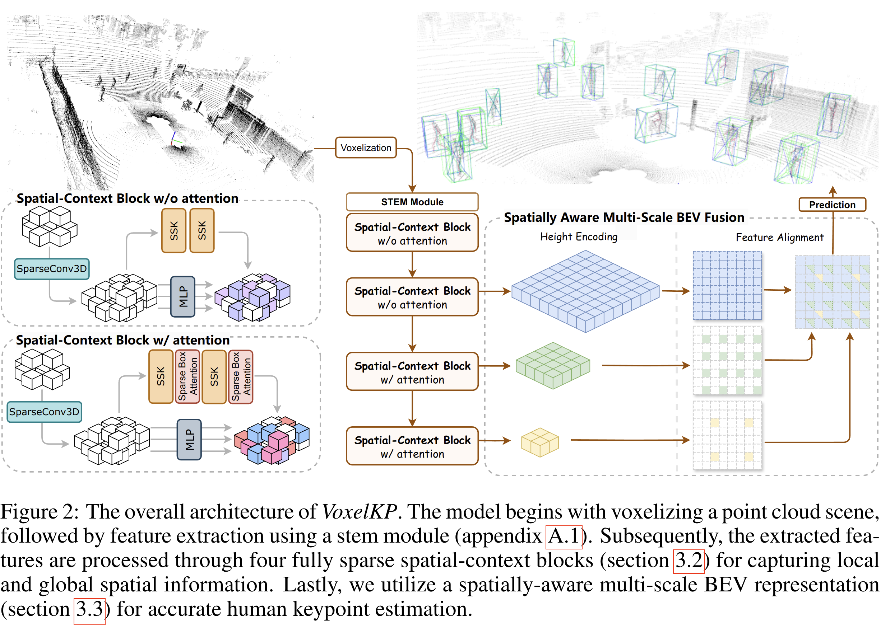

# VoxelKP: A Voxel-based Network Architecture for Human Keypoint Estimation in LiDAR Data

We present VoxelKP, a novel fully sparse network architecture tailored for human keypoint estimation in LiDAR data. We achieved the state-of-the-art performances without additional data.

## Performance Demo

[](https://youtu.be/u-xHv_OAO0M)

## Installation

Please refer to the installation of `OpenPCDet`.

## Getting Started

Please refer to [GETTING_STARTED.md](docs/GETTING_STARTED.md) to learn more usage about this project.

This is the inference only code.

Checkpoints can be downloaded from [here](https://huggingface.co/shijianjian/VoxelKP).

```bash
$ cd tools
$ python waymo_visualizer.py --ckpt CHECKPOINT
```

## Benchmarks

There is a limited number of relevant research for this task. Most of the prior works utilize additional training data beyond the 3D keypoint data within the Waymo dataset. To provide a fair comparison, we need to consider approaches that use extra data and those that rely solely on Waymo ground truth separately. 


## Experiment Results

We report the full spectrum of the evaluation, including MPJPE, OKS@AP, and PEM.

<center>

| Part      |  MPJPE |  OKS@KP |  PEM |
|-----------|:------:|:-------:|:----:|
|Head       | 0.0570 | 0.6393 | 0.1569 |
|Shoulders  | 0.0669 | 0.8917 | 0.1563 |
|Elbows     | 0.0948 | 0.7197 | 0.1746 |
|Wrists     | 0.1467 | 0.3791 | 0.1987 |
|Hips       | 0.0670 | 0.9533 | 0.1576 |
|Knees      | 0.0820 | 0.8586 | 0.1660 |
|Ankles       | 0.1084 | 0.7581 | 0.1765 |
|<b>All</b>   | 0.0887 | 0.7300 | 0.1695 |

</center>

Our visual results show that our VoxelKP offers improved keypoint estimation with precise locations and fewer false positives. 


<em>
A visual demonstration of our baseline model (top) and the proposed VoxelKP (bottom).  The insets are color-coded according to the legend in the figure. In the green-colored insets, a comparison with the ground truth is shown, with ground truth in red and predictions in blue.
</em>

## Architecture



## Acknowledgement
This repository is built on top of `OpenPCDet` and `VoxelNeXt`.

We use `sptr` implementation from [here](https://github.com/dvlab-research/SparseTransformer).
